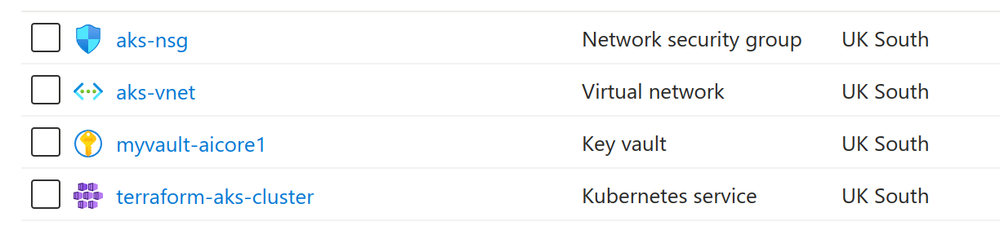
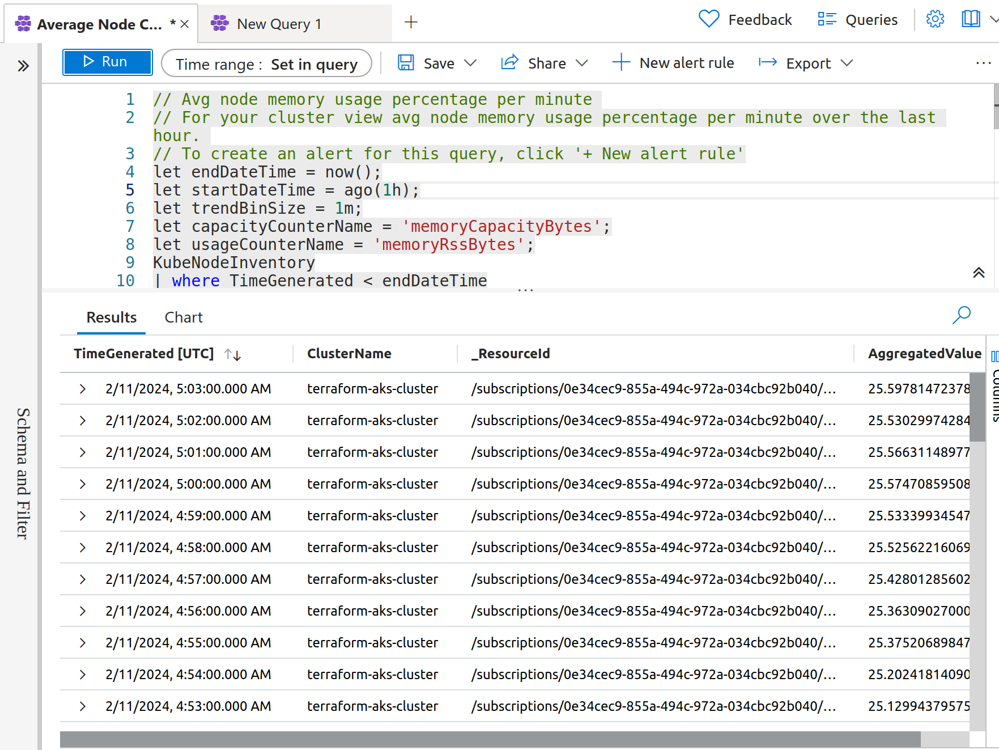
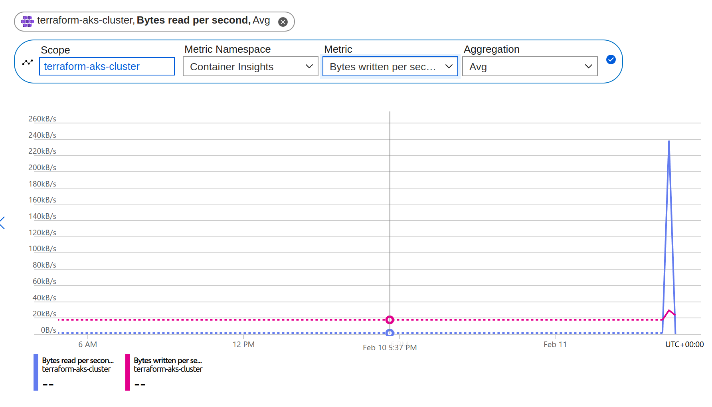
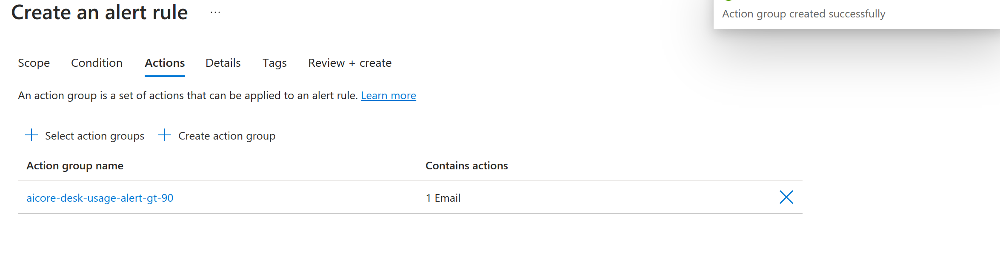
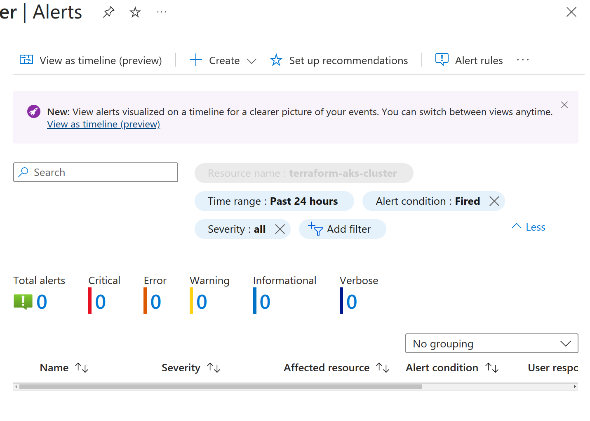

# Web-App-DevOps-Project

Welcome to the Web App DevOps Project repository! This application streamlines order management and tracking for businesses, providing an intuitive interface for interacting with order data.

## Table of Contents
- [Web-App-DevOps-Project](#web-app-devops-project)
- [Introduction](#introduction)
- [CI/CD Pipeline Overview](#cicd-pipeline-overview)
- [Features](#features)
- [Getting Started](#getting-started)
- [Installation](#installation)
  - [Installing Locally Without Containerization](#installing-locally-without-containerization)
  - [Containerization Guide for Local Development](#containerization-guide-for-local-development)
  - [Full Cloud Installation:](#full-cloud-installation)
- [Technology Stack](#technology-stack)
- [Containerization](#containerization)
- [Infrastructure as Code (IaC)](#infrastructure-as-code-iac)
- [Setting Up Azure Infrastructure with Terraform](#setting-up-azure-infrastructure-with-terraform)
- [Azure Kubernetes Service (AKS) Provisioning](#azure-kubernetes-service-aks-provisioning)
    - [1. Create a Resource Group](#1-create-a-resource-group)
    - [2. Create AKS Cluster](#2-create-aks-cluster)
    - [3. Configure kubectl to Use Your AKS Cluster](#3-configure-kubectl-to-use-your-aks-cluster)
    - [4. Verify the Cluster](#4-verify-the-cluster)
- [AKS Cluster Management and Configuration](#aks-cluster-management-and-configuration)
- [Integration with Azure DevOps](#integration-with-azure-devops)
- [CI/CD Pipeline Seamless Execution Overview](#cicd-pipeline-seamless-execution-overview)
- [Secrets Management and AKS Integration with Azure Key Vault](#secrets-management-and-aks-integration-with-azure-key-vault)

- [Monitoring and Alerts Configuration](#monitoring-and-alerts-configuration)


## Introduction

The Web-App-DevOps-Project is a comprehensive solution designed to simplify and enhance the order management process. The project integrates cutting-edge technologies and practices, such as microservices architecture, containerization, and cloud-based infrastructure, to create a robust and user-friendly platform.

## CI/CD Pipeline Overview


Our DevOps pipeline is structured to facilitate continuous integration and delivery. Here is a step-by-step overview:

1. **Build Environment**: Developers use Terraform to codify infrastructure, ensuring consistency and reliability.
2. **Commit**: Code is committed to a version control system, triggering the pipeline.
3. **Pull Secrets**: The pipeline securely retrieves secrets from Azure Key Vault, essential for resource access.
4. **Build Containers**: Application containers are built within the pipeline.
5. **Push Containers**: These containers are pushed to Docker Hub for distribution.
6. **Deploy Application**: The application is deployed to an AKS cluster.
7. **Monitor Application**: We use Azure Monitor, Application Insights, and Log Analytics to ensure optimal performance.


Merges to the main branch trigger an automated process that rebuilds the Docker image and updates the application across the AKS nodes.

## Features

This Web App DevOps Project is designed to offer a comprehensive solution for managing and tracking business orders with the following features:

- **Order List**: Offers a detailed view of all orders, including unique identifiers, user information, and order specifics.
  

- **Pagination**: Navigate through the orders with an easy-to-use pagination system, ensuring a clean user interface regardless of the number of entries.
  

- **Add New Order**: Intuitive forms to add new orders, facilitating quick and error-free entry into the system.
  

- **Data Validation**: Built-in validation ensures the integrity of the data entered, reducing errors and ensuring consistency.

## Getting Started

This section provides information on the prerequisites and the steps required to get the application up and running on your local machine.

## Prerequisites

Before you begin the installation process, make sure your system meets the following requirements:

- Python 3.8 or higher
- Docker
- Kubernetes with a running AKS cluster
- Azure CLI or Azure PowerShell Module
- Terraform v0.14 or higher
- An active Azure subscription
- Configured Azure Key Vault
- Git
- **Azure CLI**: Ensure the Azure CLI is installed and configured with your Azure account.
- **kubectl**: The Kubernetes command-line tool, kubectl, must be installed to interact with your AKS cluster.
- **Terraform**: For infrastructure as code (IaC), Terraform can be used to provision the AKS cluster.

## Installation


#### Installing Locally Without Containerization

To run the application on your local machine without containerization, you will execute the application directly in your environment. Here's how you can set it up:

1. **Environment Configuration**
   Before running the application, it's crucial to configure your environment variables. These include necessary configurations such as database URLs, API keys, and other service credentials. Run the `must-run-me private.sh` script to set these variables for your current shell session.

  ```bash
   source must-run-me private.sh
   ```
  Note: This script sets sensitive variables in your environment. Do not expose these values in public or unsecured areas.

  Clone the Repository Clone the project repository from GitHub to your local machine using the following command:

  ```bash
  git clone git@github.com:wlaa41/
  Web-App-DevOps-Project.git
  ```
  This command uses SSH to securely clone the repository. Ensure that you have configured your SSH keys in your GitHub account for this to work.

  Navigate to the Project Directory Change into the project directory that was cloned to your machine:

  ```bash
  cd Web-App-DevOps-Project
  ```
  Install Dependencies Your application likely has a list of Python dependencies that need to be installed. Use pip to install these from your requirements.txt file:

  ```bash
  pip install --no-cache-dir -r requirements.txt
  ```
  Note: It's recommended to use a virtual environment to avoid conflicts with other Python packages you might have installed.

  Run the Application Start your application. If it's a Flask app, for example, you might run it like this:

  ```bash
  python app.py
  ```

  Verify the Application is Running Open your preferred web browser and navigate to http://localhost:5000 or whichever port your application runs on. You should see the application running and be able to interact with it.

  Congratulations! You've successfully set up and run the application on your local machine.

## Containerization Guide for Local Development

This guide details the process of containerizing the Flask web application for local development. It includes steps to configure the application to run without Azure Key Vault, using local environment variables instead.

### Local Configuration

Before containerizing the application, you need to ensure it runs correctly in a non-Azure environment:

1. Comment out the Azure Key Vault credentials section in the application and replace it with your local database credentials. Change the following section in your `app.py` file:

    ```python
    # Comment out the Azure Key Vault section
    # credential = DefaultAzureCredential()
    # client = SecretClient(vault_url=key_vault_uri, credential=credential)
    # server = client.get_secret("server-name").value
    # database = client.get_secret("database-name").value
    # username = client.get_secret("server-username").value
    # password = client.get_secret("server-password").value

    # Uncomment and use local credentials
    server = 'localhost'
    database = 'your_local_database_name'
    username = 'your_local_username'
    password = 'your_local_password'
    driver = '{ODBC Driver 18 for SQL Server}' # Or the driver appropriate for your DB
    ```

2. Ensure the connection string is constructed correctly with the local variables you have set.

### Building the Docker Image

With your application configured for local use, follow these steps to create a Docker image:

1. **Build the Docker Image**
   - Navigate to the directory containing your `Dockerfile`.
   - Build your Docker image with the following command:
     ```bash
     docker build -t webapp-devops .
     ```

2. **Run the Container Locally**
   - Once the image is built, run the container using:
     ```bash
     docker run -d -p 5000:5000 webapp-devops
     ```

3. **Verify the Application is Running**
   - Open your browser and go to `http://localhost:5000`. You should see your application running.

### Notes
- Replace `webapp-devops` with the name you prefer for your Docker image.
- The `-d` flag runs the container in detached mode, leaving the terminal available for other commands.
- `-p 5000:5000` maps the container's port 5000 to your local port 5000, allowing you to access the application via `localhost`.

Remember to revert the changes made for local development before deploying the application to a production environment or pushing the code to a shared repository.

## Full Cloud Installation:

## Part 1: Setting Up Azure and Docker Hub

## 1. Azure Environment Setup
To begin deploying your application to the cloud, you first need to set up an Azure environment. This involves creating an Azure subscription, setting up a resource group, and preparing Azure services like Azure Key Vault and Azure Container Registry.

### Create an Azure Subscription
- If you don't already have an Azure subscription, create one through the [Azure Portal](https://portal.azure.com).
- Log in with your credentials and set up a payment method for billing.

### Create a Resource Group
- In the Azure Portal, navigate to **Resource groups** and click on **Add**.
- Provide a name for your resource group and select the region that is closest to you for optimal performance.
  
### Azure Key Vault Setup
- Go to **Key Vaults** in the Azure Portal and create a new one within your resource group.
- Add secrets for your application, such as database connection strings or API keys.
- Assign appropriate access policies for your applications to retrieve these secrets.

### Azure Container Registry (ACR)
- Create an Azure Container Registry to store your Docker images.
- Navigate to **Container registries** and add a new registry to your resource group.
- Choose a unique name, enable the admin user, and select a pricing tier.

## 2. Docker Hub Setup
If you prefer to use Docker Hub instead of ACR to store your Docker images, set up an account on [Docker Hub](https://hub.docker.com/).

### Create a Docker Hub Repository
- Sign in to your Docker Hub account.
- Navigate to **Repositories** and click on **Create Repository**.
- Choose a name for your repository, set it to private if necessary, and click **Create**.

**Note:** Ensure the repository name on Docker Hub matches the name used in your Dockerfile and Azure Pipeline configurations.

## 3. Local Docker Image Preparation
Before you can push your image to ACR or Docker Hub, you need to have a Docker image ready on your local machine.

### Build the Docker Image Locally
- Run the Docker build command with a tag that matches your repository name:
  ```bash
  docker build -t <docker-hub-username>/<repository-name>:<tag> .
  ```
- Ensure the build completes successfully and the image is listed in your local Docker images.

### Push the Image to Docker Hub
- Log in to Docker Hub from your command line:
  ```bash
  docker login --username <docker-hub-username>
  ```
- After successful authentication, push your image:
  ```bash
  docker push <docker-hub-username>/<repository-name>:<tag>
  ```

# Part 2: Preparing for Terraform Deployment

## 1. Azure Service Principal Creation
To allow Terraform to interact with Azure, you'll need to create a Service Principal which acts as an identity for Terraform to provision resources within your Azure subscription.

### Create Service Principal
- Use Azure CLI to create a new Service Principal and assign it a role with adequate permissions to manage resources in the specified subscription and resource group.
  ```bash
  az ad sp create-for-rbac --name <ServicePrincipalName> --role Contributor --scopes /subscriptions/<YourSubscriptionID>/resourceGroups/<YourResourceGroup>
  ```
- Take note of the `appId`, `password`, `tenant`, and `name` in the output. These will be your `TF_VAR_client_id`, `TF_VAR_client_secret`, `TF_VAR_tenant_id`, and `TF_VAR_subscription_id` respectively.

## 2. Configuring Environment Variables
Set the environment variables that Terraform will use to authenticate with Azure. Use the must-run-me.sh script to set these variables for your session.

Read `/aks-terraform/must-read-this.md` for more details

Set Environment Variables on Local Machine
Execute the must-run-me.sh script to set up the environment variables:
```bash
source must-run-me.sh
```
Alternatively, you can manually export these variables on your machine. 

### Set Environment Variables on Local Machine
- For Linux or macOS:
  ```bash
  export TF_VAR_client_id=<YourServicePrincipalAppId>
  export TF_VAR_client_secret=<YourServicePrincipalPassword>
  export TF_VAR_subscription_id=<YourAzureSubscriptionId>
  export TF_VAR_tenant_id=<YourAzureTenantId>
  ```
- For Windows (using PowerShell):
  ```powershell
  $env:TF_VAR_client_id="<YourServicePrincipalAppId>"
  $env:TF_VAR_client_secret="<YourServicePrincipalPassword>"
  $env:TF_VAR_subscription_id="<YourAzureSubscriptionId>"
  $env:TF_VAR_tenant_id="<YourAzureTenantId>"
  ```
### 3. Terraform Configuration Files
Create and configure your Terraform files, including `main.tf`, `variables.tf`, and `outputs.tf`, to define the Azure resources required for your project.

#### main.tf
- Define your provider and specify the required Azure provider version.
- Use modules or resource blocks to define your Azure resources such as AKS, Azure SQL, etc.

#### variables.tf
- Declare variables for your configurations like resource group name, location, etc.

#### outputs.tf
- Define outputs that you'll use after the Terraform deployment, like the AKS kubeconfig or public IP addresses.

##### 4. Version Controlling Terraform Files
Check your Terraform files into version control, ensuring any sensitive information is omitted or encrypted. Make use of `.gitignore` to exclude files with sensitive information.

#### .gitignore
- Include files like `*.tfvars` or the `.terraform/` directory to prevent sensitive data exposure.


# Part 3: Initializing and Applying Terraform Configuration

## 1. Terraform Initialization
Initialization is the first command that should be run after writing new Terraform configurations. It initializes various local settings and data that will be used by subsequent commands.

### Initialize Terraform
- Navigate to the directory containing your Terraform configuration files (`main.tf`, `variables.tf`, etc.).
- Run the following command to initialize Terraform:
  ```bash
  terraform init
  ```
- This command will download the necessary Terraform providers and modules required for the configuration.

## 2. Terraform Planning
The `plan` command is used to create an execution plan. Terraform performs a refresh, unless explicitly disabled, and then determines what actions are necessary to achieve the desired state specified in the configuration files.

### Create Terraform Plan
- Execute the plan command to see the changes that Terraform plans to make to your Azure resources:
  ```bash
  terraform plan
  ```
- Review the plan to ensure that the changes it proposes are expected and correct.

### 3. Terraform Applying
After planning and reviewing the proposed changes, the `apply` command is used to apply the changes required to reach the desired state of the configuration.

#### Apply Terraform Configuration
- Apply your Terraform configuration to create the resources in Azure:
  ```bash
  terraform apply
  ```
- Terraform will show the plan again and prompt for approval before making any changes. Type `yes` to proceed.

### 4. Verifying Deployment
Once Terraform has been applied, it's important to verify that the resources have been created correctly in Azure.

#### Verify Resources
- Check the Azure Portal to ensure that the resources listed in the Terraform output are correctly provisioned.
- Use the `terraform output` command to easily access the values of outputs from your Terraform state file.

### 3. Terraform Configuration Files
Create and configure your Terraform files, including `main.tf`, `variables.tf`, and `outputs.tf`, to define the Azure resources required for your project.

#### main.tf
- Define your provider and specify the required Azure provider version.
- Use modules or resource blocks to define your Azure resources such as AKS, Azure SQL, etc.

#### variables.tf
- Declare variables for your configurations like resource group name, location, etc.

#### outputs.tf
- Define outputs that you'll use after the Terraform deployment, like the AKS kubeconfig or public IP addresses.

### 4. Version Controlling Terraform Files
Check your Terraform files into version control, ensuring any sensitive information is omitted or encrypted. Make use of `.gitignore` to exclude files with sensitive information.

#### .gitignore
- Include files like `*.tfvars` or the `.terraform/` directory to prevent sensitive data exposure.


## Part 4: CI/CD Pipeline Setup in Azure DevOps

### 1. Docker Image Creation and Push to Registry
Utilizing the Dockerfile provided, build a Docker image that will be pushed to a container registry, which in this case can be Docker Hub or Azure Container Registry (ACR).

### Build the Docker Image
-# Execute the Docker build command within the directory containing your Dockerfile. Tag the image appropriately:
  ```bash
  docker build -t your-username/your-repo-name:tag .
  ```

#### Push the Image to the Registry
- Authenticate with your container registry and push the built image:
  ```bash
  docker login
  docker push your-username/your-repo-name:tag
  ```

### 2. Azure DevOps Pipeline Configuration
Create a CI/CD pipeline in Azure DevOps that builds the Docker image, pushes it to the container registry, and deploys it to Azure Kubernetes Service (AKS) using the `azure-pipelines.yml` file.

#### Create a New Pipeline
- In Azure DevOps, navigate to Pipelines and create a new pipeline.
- Connect your GitHub repository or another source where your code is stored.
- Select the existing `azure-pipelines.yml` file or create a new one.

#### Pipeline YAML File
- Use the provided `azure-pipelines.yml` file, which defines steps for building and pushing the Docker image and deploying it to AKS.
- Make sure to replace `walaab/aicorefinalproject` with your actual Docker Hub repository or ACR name.
- Customize the AKS deployment details, like resource group and cluster name, to match your environment.

### 3. Terraform Deployment
With Terraform, automate the provisioning of your AKS cluster and related Azure resources as described in the `main.tf` and `variables.tf` files.

### Terraform Apply
- Run `terraform apply` within your CI/CD pipeline to create or update the AKS cluster as defined in your Terraform files.

### 4. Application Deployment to AKS
Deploy your application to AKS using the Kubernetes manifest file `application-manifest.yaml`.

#### Kubernetes Manifest
- The `application-manifest.yaml` file defines the desired state of your application deployment and service in the AKS cluster.
- Update the `image` property to use the Docker image URL from your container registry.

### 5. Monitoring and Management
Once deployed, monitor the AKS cluster and application using Azure Monitor and other Azure services. Ensure logging and monitoring are configured for observability.

### Verify Deployment
- After the pipeline runs, verify that the application is successfully deployed to AKS by checking the output of `kubectl get pods`.
- Access your application via the load balancer or ingress controller as configured in your AKS setup.

## Technology Stack

Our Web App DevOps Project leverages a comprehensive technology stack designed to offer a robust, scalable, and user-friendly experience. Here's a breakdown of the technologies used and their significance in the project.

### Backend: Flask

Flask is a lightweight WSGI web application framework in Python, chosen for its simplicity and flexibility. It serves as the backbone of our application, handling HTTP requests, routing, and server-side logic. Flask's minimalistic but extensible approach allows us to efficiently develop and maintain the application's core functionalities.

```python
from flask import Flask, request, jsonify
app = Flask(__name__)

@app.route('/orders', methods=['GET'])
def list_orders():
    # Example function to list orders
    return jsonify({'orders': []})
```

### Frontend: HTML, CSS, and JavaScript

The user interface is crafted with HTML for structure, CSS for styling, and JavaScript for interactivity. This combination ensures a seamless and engaging user experience, making it intuitive for users to navigate through the application and perform actions like viewing orders or adding new ones.


### Database: Azure SQL Database

Azure SQL Database, a fully managed cloud database provided by Microsoft Azure, stores and manages the application's data. It offers high availability, security, and scalability. The choice of Azure SQL Database aligns with our cloud-first strategy, ensuring data persistence and reliability across the application lifecycle.

```sql
CREATE TABLE Orders (
    OrderID int,
    UserID int,
    ProductID int,
    Quantity int,
    OrderDate datetime,
    PRIMARY KEY (OrderID)
);
```

### Containerization: Docker

Docker is utilized for containerizing the application, encapsulating it and its dependencies into a single container image. This ensures consistency across different development and deployment environments, simplifying deployment processes and scaling operations.

```dockerfile
# Example Dockerfile snippet for Flask application
FROM python:3.8-slim
WORKDIR /app
COPY . /app
RUN pip install -r requirements.txt
CMD ["python", "app.py"]
```


### DevOps: Azure DevOps and AKS

Azure DevOps provides a suite of development tools for CI/CD, enabling automatic build, test, and deployment pipelines. Azure Kubernetes Service (AKS) is used for orchestrating the deployment of containerized applications, offering easy scaling and management.

- **CI/CD Pipeline**: Automated processes for building, testing, and deploying the application.
- **AKS Deployment**: Manages and scales the application in a Kubernetes environment.


This technology stack provides a solid foundation for developing, deploying, and managing the Web App DevOps Project, emphasizing efficiency, scalability, and user experience.


## Reverted Features: Delivery Date Column

### Overview
The Delivery Date feature was introduced to enhance order management by tracking the anticipated delivery dates for orders. However, due to unforeseen complexities and user feedback, this feature was later reverted.

### Technical Details
- **Branch**: `feature/delivery-date`
- **Reversion Commit**: The reversion occurred in commit `abc123`, which removed the delivery date functionality from the main application flow.

#### Implementation
The feature added a `delivery_date` column to the orders database schema. This required updates to both the backend logic and the frontend UI to collect, process, and display delivery dates.

#### Challenges
The reversion was primarily due to challenges in accurately predicting delivery dates across diverse geographic locations and vendors, leading to user dissatisfaction.

### Learning Outcomes
This experience highlighted the importance of robust feature testing and user feedback in the early stages of feature development. Future features will undergo more extensive beta testing with a diverse user group.

## Containerization

### Overview
Containerization involves encapsulating the application and its environment into a container that can be run on any Docker-compatible system. This approach significantly simplifies deployments and ensures consistency across development, testing, and production environments.

### Dockerfile Breakdown
```dockerfile
FROM python:3.8-slim
WORKDIR /app
COPY . .
RUN pip install -r requirements.txt
EXPOSE 5000
CMD ["python", "app.py"]
```

- `FROM python:3.8-slim`: Uses Python 3.8 slim image as the base image.
- `WORKDIR /app`: Sets the working directory inside the container.
- `COPY . .`: Copies the application source code into the container.
- `RUN pip install -r requirements.txt`: Installs the application dependencies.
- `EXPOSE 5000`: Informs Docker that the container listens on port 5000.
- `CMD ["python", "app.py"]`: The command that runs the application within the container.

### Building and Running the Container
```bash
docker build -t webapp-devops .
docker run -d -p 5000:5000 webapp-devops
```
- Builds the Docker image tagged as `webapp-devops`.
- Runs the container in detached mode, mapping port 5000 on the host to port 5000 in the container.

### Benefits for Development and Ops
Containerization with Docker offers numerous benefits:
- **Consistency**: Ensures that the application runs the same way in every environment.
- **Isolation**: Each container operates independently, reducing conflicts between running applications.
- **Scalability**: Containers can be easily scaled up or down to match demand.


This modern approach to deployment aligns with DevOps practices, facilitating continuous integration and continuous delivery (CI/CD) pipelines for faster and more reliable application updates.


## Infrastructure as Code (IaC)

Infrastructure as Code (IaC) is a key practice in DevOps, allowing the management of infrastructure (networks, virtual machines, load balancers, and connection topology) in a descriptive model, using the same versioning as DevOps team uses for source code. In simple terms, IaC allows developers and IT operations teams to automatically manage, monitor, and provision resources through code rather than manual processes.

### Understanding IaC with Terraform

Terraform, by HashiCorp, is an open-source tool that allows you to define both cloud and on-prem resources in human-readable configuration files that can be versioned, reused, and shared. With Terraform, infrastructure is managed as code; you can apply practices like code review, version control, and continuous integration/continuous deployment (CI/CD) to your infrastructure.

#### Key Concepts of Terraform

- **Providers**: Terraform relies on plugins called "providers" to interact with cloud providers, SaaS providers, and other APIs. For instance, the Azure provider allows you to manage Azure resources.
- **Resources**: These are the most important element in Terraform. Each resource block describes one or more infrastructure objects, such as virtual networks, compute instances, or higher-level components such as DNS records.

```hcl
resource "azurerm_resource_group" "rg" {
  name     = "example-resources"
  location = "East US"
}
```

- **Modules**: Terraform modules allow you to create reusable components for your infrastructure, promoting code reuse and reducing redundancy.

#### Why Use IaC?

1. **Speed and Simplicity**: Automated deployment of infrastructure speeds up the process and reduces manual errors.
2. **Consistency**: Ensure your infrastructure is deployed consistently in every environment, from development to production.
3. **Traceability**: By using source control with your IaC files, you can trace every change made to your infrastructure.



### Setting Up Azure Infrastructure with Terraform

To get started with Terraform on Azure, you'll need a few components:

- **Azure Subscription**: An active subscription where resources will be provisioned.
- **Terraform Installed**: Ensure you have Terraform installed on your machine or CI/CD environment.
- **Azure CLI or PowerShell**: For authentication with Azure from your local machine.

#### Basic Terraform Workflow

1. **Write**: Define your infrastructure as code with Terraform configuration files.
2. **Plan**: Execute `terraform plan` to preview the changes Terraform will make to your infrastructure.
3. **Apply**: Run `terraform apply` to provision the resources defined in your Terraform configuration.

```bash
terraform init
terraform plan
terraform apply
```

#### Terraform State

Terraform keeps track of your infrastructure's state, allowing it to create incremental changes, track resource dependencies, and more. The state is stored by default in a file named `terraform.tfstate`.

### Best Practices for IaC with Terraform

- **Version Control**: Store your Terraform configurations in a version control system to keep track of changes and facilitate collaboration.
- **Modularize**: Use modules to break down your configurations into manageable, reusable pieces.
- **Secure Secrets**: Use Terraform's secret management tools or integrate with a secret manager like Azure Key Vault to handle sensitive information.


By adopting Infrastructure as Code, teams can ensure that their infrastructure provisioning processes are as agile, reliable, and transparent as their application development workflows.


# Azure Kubernetes Service (AKS) Provisioning

Provisioning an Azure Kubernetes Service (AKS) cluster involves several steps that collectively ensure a robust and scalable container orchestration environment on Azure. This guide aims to provide a comprehensive overview of the AKS provisioning process, suitable for both beginners and experienced professionals.

### Overview

AKS simplifies the deployment, management, and operations of Kubernetes. It offers integrated continuous integration and continuous delivery (CI/CD) experiences, security and compliance features, and scalability without sacrificing the flexibility that Kubernetes users need.


### Step-by-Step Guide

#### 1. Create a Resource Group

A resource group is a container that holds related resources for an Azure solution. The AKS cluster and its related resources will reside within this group.

```bash
az group create --name myResourceGroup --location eastus
```

#### 2. Create AKS Cluster

Use the Azure CLI to create an AKS cluster. The process involves specifying the resource group, the cluster name, and the node count.

```bash
az aks create --resource-group myResourceGroup --name myAKSCluster --node-count 3 --enable-addons monitoring --generate-ssh-keys
```

#### 3. Configure kubectl to Use Your AKS Cluster

After the cluster is created, configure `kubectl` to use it by downloading the AKS cluster's credentials.

```bash
az aks get-credentials --resource-group myResourceGroup --name myAKSCluster
```

#### 4. Verify the Cluster

Verify that `kubectl` is configured to communicate with your cluster.

```bash
kubectl get nodes
```

### AKS Cluster Management and Configuration

- **Scaling**: AKS clusters can be scaled up or down to meet demand.
  ```bash
  az aks scale --resource-group myResourceGroup --name myAKSCluster --node-count 5
  ```

- **Monitoring and Logging**: Enable Azure Monitor for containers for visibility into your applications.
  ```bash
  az aks enable-addons --addons monitoring --resource-group myResourceGroup --name myAKSCluster
  ```

- **Security**: Utilize Azure Active Directory (AAD) and role-based access control (RBAC) to secure access to your cluster.

### Integration with Azure DevOps

- **CI/CD Pipelines**: Automate the build, test, and deployment of your applications directly to AKS with Azure DevOps.

- **Infrastructure as Code**: Use Terraform or ARM templates to define and manage your AKS infrastructure as code, ensuring consistency and repeatability.

### Conclusion

Provisioning an AKS cluster on Azure provides a powerful, scalable platform for deploying containerized applications. By following these steps and leveraging Azure's native tools and services, teams can achieve efficient and secure Kubernetes deployments.


For further information, refer to the [Azure Kubernetes Service documentation](https://docs.microsoft.com/en-us/azure/aks/).


## CI/CD Pipeline Seamless Execution Overview

Upon merging changes into the main branch, our CI/CD pipeline in Azure DevOps is automatically triggered, performing a seamless transition from code commit to deployment:

- **Auto-Trigger**: Merges to the main branch instantaneously initiate the pipeline, ensuring that the latest code changes are automatically queued for build and deployment.
- **Build Image**: Leveraging Azure Pipelines, the Docker image is automatically built, incorporating the latest changes from the main branch. This step ensures that the application is packaged with all necessary dependencies and is ready for deployment.
- **Push & Deploy**: The freshly built image is then pushed to a container registry, and from there, it is deployed to the AKS cluster. The deployment utilizes a rolling update strategy, minimizing downtime and ensuring that the application remains available throughout the update process.
- **Monitor**: The entire CI/CD process is monitored, with real-time validation of each step's success. This ensures that the application is always running the latest codebase, and any issues in the pipeline can be quickly identified and addressed.


### CI/CD Pipeline Details

The CI/CD pipeline is configured to ensure that the integration and deployment of changes are as smooth as possible. This is achieved through a series of steps that automate the build, test, and deployment processes, significantly reducing manual intervention and minimizing the risk of human error.

#### Pipeline Workflow

1. **Code Commit**: Developers commit code to the main branch, triggering the pipeline.
2. **Build**: The pipeline builds the Docker image, ensuring that the application is packaged with all its dependencies.
3. **Test**: Automated tests are run to ensure the application behaves as expected.
4. **Deploy**: The application is deployed to the AKS cluster, with zero downtime.

This CI/CD pipeline ensures that our application is always up-to-date with the latest features and bug fixes, ready to serve our users without interruption.

## Secrets Management and AKS Integration with Azure Key Vault

#### Azure Key Vault Setup and Permissions

Azure Key Vault plays a pivotal role in managing secrets, keys, and certificates for Azure applications, ensuring enhanced security and compliance. Its integration into Azure Kubernetes Service (AKS) environments streamlines secret management and safeguards sensitive data.

##### Key Vault Setup

Setting up Azure Key Vault involves creating the vault through the Azure Portal and configuring access policies to control who can manage and access its contents. This centralized secrets management solution prevents sensitive data from being hard-coded or exposed within the application's codebase.

```bash
az keyvault create --name <YourKeyVaultName> --resource-group <YourResourceGroupName> --location <YourLocation>
```

##### Permissions

Assigning roles such as `Key Vault Secrets Officer` and `Key Vault Reader` ensures efficient and secure management of the Key Vault content. The principle of least privilege is meticulously applied to grant only necessary permissions to service principals and managed identities.

#### Managed Secrets in Key Vault

Azure Key Vault stores critical secrets for applications, including database server names, usernames, and passwords. Each secret can be dynamically referenced by the application using environment variables and the Azure Key Vault library.

##### Example of Retrieving a Secret

```python
from azure.identity import DefaultAzureCredential
from azure.keyvault.secrets import SecretClient

key_vault_uri = f"https://<YourKeyVaultName>.vault.azure.net/"
credential = DefaultAzureCredential()
client = SecretClient(vault_url=key_vault_uri, credential=credential)

secret_name = "database-password"
retrieved_secret = client.get_secret(secret_name)

print(f"The secret is: {retrieved_secret.value}")
```

#### AKS Integration with Key Vault

Integrating Azure Key Vault with AKS involves configuring the AKS cluster with a managed identity. This identity is granted permissions to retrieve secrets from Key Vault, enabling secure access to sensitive information without storing it in the application's configuration.

##### Configuring Managed Identity

```bash
az aks update -n <YourClusterName> -g <YourResourceGroupName> --enable-managed-identity
```

### Logging and Observability

Integrating Azure Key Vault into the application lifecycle includes extensive logging of secret retrievals and interactions with the database. All logs are streamed to Azure Monitor Log Analytics, providing a comprehensive view of the application's performance and security.


By leveraging Azure Key Vault for secrets management in AKS deployments, applications benefit from enhanced security, centralized management, and streamlined operations, significantly bolstering their overall security posture.


# Monitoring and Alerts Configuration

As part of our ongoing efforts to maintain and optimize the performance and reliability of our Azure Kubernetes Service (AKS) cluster, we've implemented a robust monitoring and alerting strategy. Here are the key milestones we've achieved:

## Enabled Container Insights

We've enabled Container Insights for our AKS cluster, which is instrumental in collecting comprehensive, real-time performance and diagnostic data. This enables us to monitor our application performance efficiently and troubleshoot issues proactively.

```bash
az aks update -g networking-resource-group -n terraform-aks-cluster --enable-managed-identity
```

## Configured Metrics Explorer

We've set up the following charts in Metrics Explorer to visualize crucial performance metrics:

- **Average Node CPU Usage**: Tracks the CPU usage across nodes, assisting in resource allocation and performance issue detection.
- **Average Pod Count**: Displays the running pod count, providing insights into cluster capacity and workload distribution.
- **Used Disk Percentage**: Helps monitor disk space utilization to prevent storage bottlenecks.



- **Bytes Read and Written per Second**: Offers visibility into data transfer rates to identify potential performance bottlenecks.



## Configured Log Analytics

We've configured Log Analytics to record and save logs for the following:

- **Average Node CPU Usage Percentage per Minute**: Captures granular node-level CPU usage data.
- **Average Node Memory Usage Percentage per Minute**: Monitors memory usage to detect potential performance concerns.
- **Pod Counts with Phase**: Provides a count of pods in various lifecycle phases.
- **Warning Values in Container Logs**: Searches for warning messages within container logs to facilitate prompt issue resolution.
- **Kubernetes Events Monitoring**: Tracks critical events in the cluster such as pod scheduling, scaling, and errors.

## Set Up Alert Rules

We've established alert rules to ensure the health of our cluster:

- **Disk Usage Alert**: Triggers an alarm if the used disk percentage exceeds 90%, with checks every 5 minutes and a 15-minute loopback period.
- **CPU and Memory Resource Alert**: Alerts are triggered when CPU usage and memory working set percentage exceed 80%, allowing us to address resources nearing critical levels promptly.



These measures ensure we are immediately notified of any potential issues, maintaining the cluster's overall health and stability.

