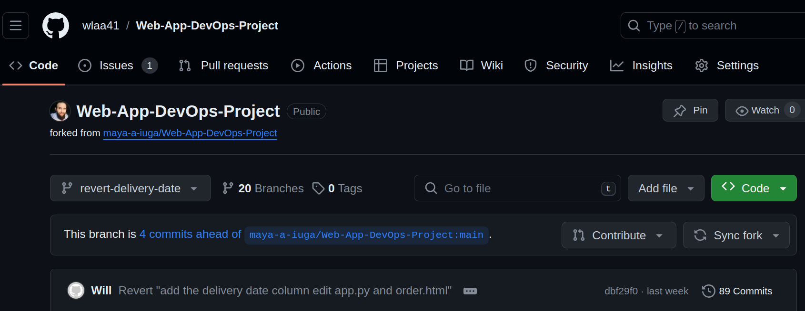
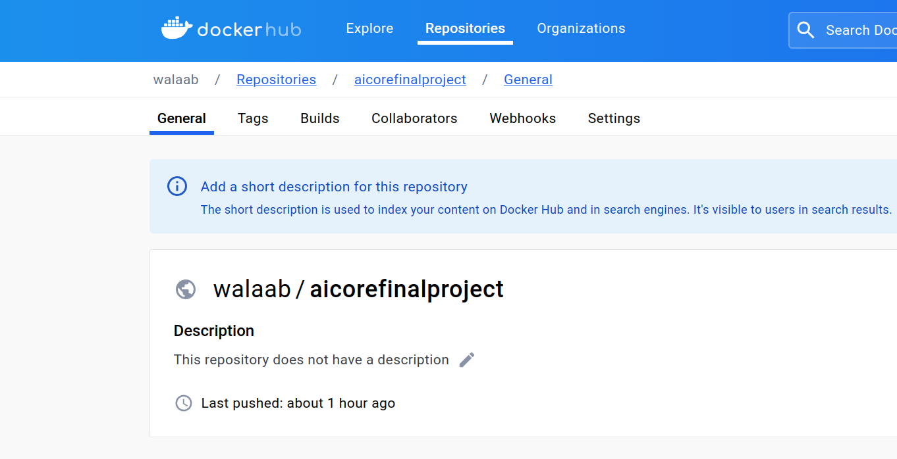
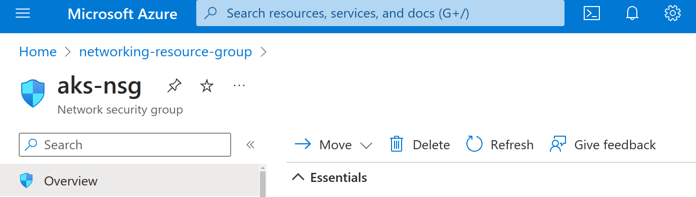
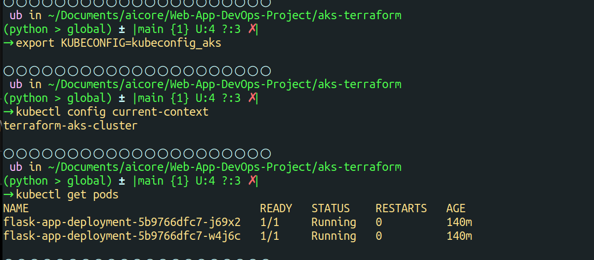
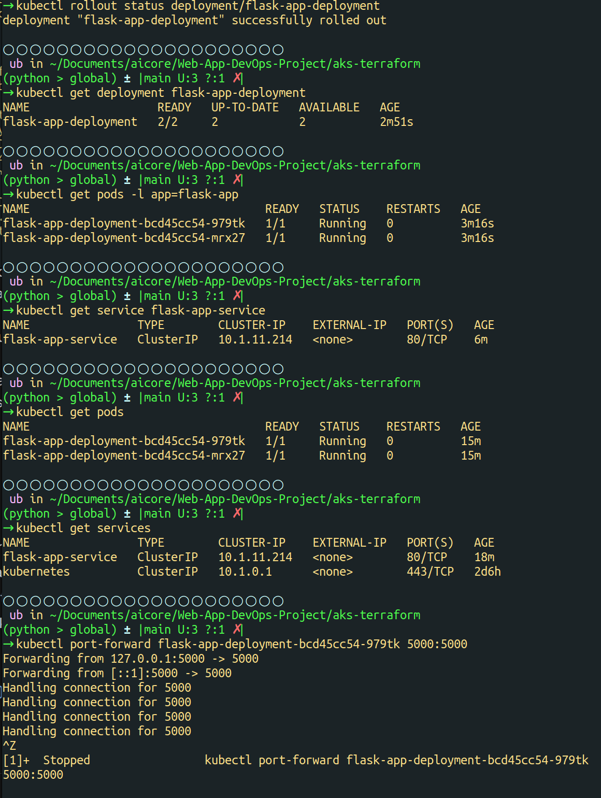

# Web-App-DevOps-Project

Welcome to the Web App DevOps Project repo! This application allows you to efficiently manage and track orders for a potential business. It provides an intuitive user interface for viewing existing orders and adding new ones.
.png)

## Table of Contents

- [Features](#features)
- [Getting Started](#getting-started)
- [Technology Stack](#technology-stack)
- [Reverted Features](#rSeverted-features)
- [Containerization](#containerization)
- [Containerization](#containerization)
- [Infrastructure as Code](#infrastructure-as-code)
- [AKS Cluster Provisioning with Terraform](#aks-cluster-provisioning-with-terraform)
- [Configuring kubectl with AKS kubeconfig](#configuring-kubectl-with-aks-kubeconfig)
- [Kubernetes Deployment Documentation](#Kubernetes-deployment-documentation)
- [Monitoring and Alerts Configuration](#monitoring-and-alerts-configuration)
- [Contributors](#contributors)
- [License](#license)


## Features

- **Order List:** View a comprehensive list of orders including details like date UUID, user ID, card number, store code, product code, product quantity, order date, and shipping date.
  


- **Pagination:** Easily navigate through multiple pages of orders using the built-in pagination feature.
  


- **Add New Order:** Fill out a user-friendly form to add new orders to the system with necessary information.
  


- **Data Validation:** Ensure data accuracy and completeness with required fields, date restrictions, and card number validation.

## Getting Started

### Prerequisites

For the application to succesfully run, you need to install the following packages:

- flask (version 2.2.2)
- pyodbc (version 4.0.39)
- SQLAlchemy (version 2.0.21)
- werkzeug (version 2.2.3)

### Usage

To run the application, you simply need to run the `app.py` script in this repository. Once the application starts you should be able to access it locally at `http://127.0.0.1:5000`. Here you will be meet with the following two pages:

1. **Order List Page:** Navigate to the "Order List" page to view all existing orders. Use the pagination controls to navigate between pages.

2. **Add New Order Page:** Click on the "Add New Order" tab to access the order form. Complete all required fields and ensure that your entries meet the specified criteria.

## Technology Stack

- **Backend:** Flask is used to build the backend of the application, handling routing, data processing, and interactions with the database.

- **Frontend:** The user interface is designed using HTML, CSS, and JavaScript to ensure a smooth and intuitive user experience.

- **Database:** The application employs an Azure SQL Database as its database system to store order-related data.

## Reverted Features: Delivery Date Column

### Delivery Date Column
#### Overview
The `delivery_date` feature, aimed at tracking order delivery dates, was added and later reverted. This documentation provides detailed implementation and potential usage for future reference.

#### Developer Guide

- **Branch Name**: `revert-delivery-date`
- **Commit Hash for Revert**: The feature was reverted in commit `9da61682fe08c6e7d7827f4fb476617c9f49a053` on the `revert-delivery-date` branch.

##### Database Model
- **Model Changes**: Added a `delivery_date` column to the `Order` class in `app.py`.

##### Backend Changes
- **Route Update**: Modified the `/add_order` route to include `delivery_date` processing.

##### Frontend Adjustments
- **Form Update**: Updated `order.html` to incorporate a `delivery_date` field for adding and displaying orders.

#### User Guide

- **Placing Orders**: Users had the option to specify delivery dates for new orders via a dedicated field.
- **Viewing Orders**: Delivery dates were displayed in the order list, alongside other essential order details.




This feature has been documented with branch and commit details for potential reintegration or reference in the future.

## Containerization

### Containerization Process

#### Building the Dockerfile

1. **Dockerfile Overview**: The provided Dockerfile is a set of instructions for Docker to automatically build a container image for our web application.

2. **Base Image**: We start with `python:3.8-slim` as our base image, chosen for its balance between size and utility, providing a Python environment with minimal overhead.

3. **Working Directory**: Setting the working directory to `/app` ensures that all subsequent commands run in this location within the container.

4. **Dependencies**: Essential system dependencies are installed using `apt-get` to ensure that our application has all the necessary libraries and tools, such as `gcc` for compiling and `unixodbc-dev` for database connectivity.

5. **Python Environment**: We upgrade `pip` and install the required Python packages as specified in `requirements.txt`, ensuring that the Python environment is prepared with the dependencies our application needs.

6. **Final Steps**: We set the command to run the application using `CMD` and document the port that our application will be served on using `EXPOSE`.

### Docker Commands

#### Usage

- **Building the Image**: `docker build -t webapp-devops .` to create an image from the Dockerfile in the current directory.
- **Running a Container**: `docker run -p 5000:5000 webapp-devops` to start a container and expose it on port 5000.
- **Tagging the Image**: `docker tag webapp-devops walaab/aicorefinalproject` to assign a tag to the image for pushing to Docker Hub.
- **Pushing to Docker Hub**: `docker push walaab/aicorefinalproject` to upload the tagged image to Docker Hub.



### Image Information

The Docker image for the Web-App-DevOps-Project includes all the dependencies and configurations required to run the web application in a containerized environment. The image is named `webapp-devops` and is tagged as `walaab/aicorefinalproject` for version control and distribution through Docker Hub.

## Infrastructure as Code

#### Networking Setup

The foundation of our  application's infrastructure on Azure is laid out using Terraform, an Infrastructure as Code (IaC) tool, which enables us to define, provision, and manage the cloud infrastructure using configuration files. Below are the steps and components involved in setting up the networking infrastructure for our application.

### Networking with Terraform on Azure

#### Prerequisites

- Terraform v0.14+
- Azure CLI or Azure PowerShell Module
- An Azure subscription and tenant
- Azure Key Vault set up with service principal credentials stored as secrets

### Modules Overview
- **Networking Module**: Sets up the required networking infrastructure, including the virtual network (VNet), subnets for control plane and worker nodes, and network security group (NSG) rules for secure access.
- **AKS Cluster Module**: Provisions the AKS cluster with specified Kubernetes version, DNS prefix, and integrates with the networking module to place the cluster in the created VNet and subnets. Also, it uses Azure Key Vault to securely retrieve the service principal credentials needed for AKS.


### Resource Group

- **File**: `main.tf`
- **Resource**: `azurerm_resource_group`
- **Purpose**: Serves as a container that holds related resources for the e-commerce application.
- **Importance**: Essential (1)
- **Dependencies**: All networking resources are dependent on the resource group.
- **Variables**:
  - `resource_group_name`: Name for the Azure Resource Group.
  - `location`: Geographic location for the deployment of resources.

### Virtual Network (VNet)

- **File**: `main.tf`
- **Resource**: `azurerm_virtual_network`
- **Purpose**: Provides a private network for the e-commerce application where resources such as VMs and databases can securely communicate.
- **Importance**: Essential (1)
- **Dependencies**: Must be created within the resource group defined above.
- **Variables**:
  - `vnet_address_space`: Defines the IP address range for the VNet.

### Subnets

- **File**: `main.tf`
- **Resources**: `azurerm_subnet`
  - **control_plane_subnet**: Dedicated subnet for the control plane components, ensuring isolated and secure management operations.
  - **worker_node_subnet**: Dedicated subnet for the worker nodes where the application components are deployed.
- **Purpose**: Segregates the network for organizational and security purposes.
- **Importance**: Essential (1)
- **Dependencies**: Depends on the virtual network.

## Security and Access
- Network Security Group (NSG) rules are configured to restrict access to the Kubernetes API server and SSH access to nodes, based on your public IP address for enhanced security.
- Service principal credentials are securely fetched from Azure Key Vault, ensuring sensitive information is not hardcoded in the Terraform files.

### Network Security Group (NSG)

- **File**: `main.tf`
- **Resource**: `azurerm_network_security_group`
- **Purpose**: Defines security rules for the network, controlling inbound and outbound traffic to VMs and services.
- **Importance**: Essential (1)
- **Dependencies**: Tied to the subnets and must align with the overall security posture.
- **Security Rules**:
  - **kube-apiserver-rule**: Allows traffic to the Kubernetes API server.
  - **ssh-rule**: Permits SSH access to the cluster for remote management.

## Outputs
- **Networking Module Outputs (`output.tf`)**: Outputs from the networking module include IDs for the created VNet, subnets, and NSG, which are consumed by the AKS cluster module.
- **AKS Cluster Module Outputs (`output.tf`)**: Outputs the AKS cluster name, ID, and kubeconfig. The kubeconfig output is marked as sensitive to prevent it from being displayed in logs.

### Output Variables

- **File**: `outputs.tf`
- **Purpose**: Outputs the IDs and names of the created resources, which are necessary for referencing these resources in other parts of the Terraform configuration or for external use.
- **Importance**: High (2)
- **Details**:
  - `vnet_id`: The ID of the created VNet.
  - `control_plane_subnet_id`: The ID of the control plane subnet.
  - `worker_node_subnet_id`: The ID of the worker node subnet.
  - `networking_resource_group_name`: The name of the resource group where networking resources are provisioned.
  - `aks_nsg_id`: The ID of the Network Security Group.

### Input Variables

- **File**: `variables.tf`
- **Purpose**: Allows customization of the networking module by defining variables that can be passed to the Terraform configuration.
- **Importance**: High (2)
- **Details**: Includes descriptions and default values for the resource group name, location, and VNet address space.

## Steps to Provision the Networking Infrastructure

1. **Initialization**: Run `terraform init` in the root directory to initialize the Terraform workspace.
2. **Configuration**: Update the `terraform.tfvars` with the desired values for the input variables.
3. **Planning**: Execute `terraform plan` to review the proposed changes to your infrastructure.
4. **Application**: Apply the configuration with `terraform apply` to create the networking infrastructure.
5. **Validation**: Use the output variables to validate the creation of the networking components.

By following these steps, you will have a secure and scalable network infrastructure on Azure, ready to support the demands of your e-commerce application.

## AKS Cluster Provisioning with Terraform

This section of the README outlines the process of provisioning an AKS cluster using Terraform as part of our e-commerce infrastructure. We employ Infrastructure as Code (IaC) to ensure that our infrastructure provisioning is repeatable, consistent, and versioned.

### Provisioning Steps

1. **Define the Resource Group**: The `azurerm_resource_group` resource is used to create a logical container for our AKS-related networking resources, which aids in organization and cost tracking.

2. **Create the Virtual Network (VNet)**: Using the `azurerm_virtual_network` resource, we define the VNet where our AKS cluster will reside. This network is crucial for the internal communication between services.

3. **Set Up Subnets**: Subnets are defined within the VNet using `azurerm_subnet` resources. We create separate subnets for the control plane and worker nodes, providing a structured network space with improved security.

4. **Network Security Group (NSG) Configuration**: An NSG named `aks-nsg` is created with `azurerm_network_security_group` to define network security rules that control inbound and outbound traffic.

5. **Define Security Rules**: Specific rules, such as `kube-apiserver-rule` and `ssh-rule`, are defined using `azurerm_network_security_rule` resources to govern access to the AKS cluster.

6. **Output Variable Declaration**: Output variables like `vnet_id` and `aks_cluster_id` are declared to expose essential information about the provisioned resources.

7. **Initialize the Terraform Configuration**: Run `terraform init` within the `aks-cluster-module` directory to prepare Terraform for operation.

8. **Plan the Deployment**: Execute `terraform plan` to review the actions Terraform will perform based on the configuration files.

9. **Apply the Configuration**: Run `terraform apply` to create the defined resources on Azure.

### Input Variables

- `resource_group_name`: The name for the Azure Resource Group.
- `location`: The Azure region where the resources will be deployed.
- `vnet_address_space`: The address space for the VNet.
- `control_plane_subnet_id`: The ID for the control plane's subnet.
- `worker_node_subnet_id`: The ID for the worker nodes' subnet.

### Output Variables

- `vnet_id`: The ID of the created VNet.
- `aks_cluster_id`: The ID of the provisioned AKS cluster.
- `aks_kubeconfig`: The kubeconfig file for managing the AKS cluster.

These variables are crucial for the connectivity and management of the AKS cluster, which underpins our e-commerce platform's operations.

### Pushing to GitHub

To ensure that our IaC code is versioned and changes are tracked, we push our latest Terraform configuration to GitHub using the following commands:

```sh
git add .
git commit -m "Add AKS cluster provisioning with Terraform"
git push origin main
```

Replace `main` with the name of the branch you are pushing to if it's not the main branch.

## Configuring kubectl with AKS kubeconfig

After saving the kubeconfig file for your Azure Kubernetes Service (AKS) cluster, you need to configure `kubectl` to use this file for communication with your Kubernetes cluster. Follow the steps below to set this up:

```bash
# Set the KUBECONFIG environment variable to point to your kubeconfig file
export KUBECONFIG=./kubeconfig_aks

# With KUBECONFIG set, you can now use kubectl to interact with your AKS cluster.
# To get the list of nodes in your cluster, run:
kubectl get nodes
```


Ensure that the `kubeconfig_aks` file is present in the current directory or update the path accordingly.

## Kubernetes Deployment Documentation

### Introduction

This section of the README outlines the processes and configurations involved in deploying our Flask application within the Azure Kubernetes Service (AKS). It covers the creation and explanation of Deployment and Service manifests, the chosen deployment strategy, and the testing and validation procedures following deployment.

### Deployment and Service Manifests

#### Deployment Manifest

Our application's deployment is managed by a Kubernetes Deployment manifest. This manifest ensures that two replicas of the Flask application are running at any given time for high availability and load distribution. The key components of this manifest are:

- **Metadata**: Identifies the deployment with the name `flask-app-deployment`.
- **Replicas**: Specifies the desired number of application instances.
- **Selector**: Matches the labels to identify the pods that the Deployment manages.
- **Template**: Defines the pod template and includes:
  - **Containers**: Specifies the container image `walaab/aicorefinalproject:latest` and the container port `5000`.

#### Service Manifest

The Service manifest defines how the Flask application's pods are exposed within the cluster:

- **Selector**: Matches the labels to determine which pods will handle the traffic.
- **Ports**: Maps port `80` on the Service to target port `5000` on the Flask application pods.
- **Type**: `ClusterIP` ensures the Service is only reachable within the cluster, providing a stable internal endpoint.

### Deployment Strategy

We employ a **RollingUpdate** strategy to minimize downtime and ensure a smooth transition between the old and new versions of the application:

- **Max Unavailable**: Limits the number of pods that can be unavailable during the update.
- **Max Surge**: Controls the number of additional pods that can be created above the desired number of pods.

This strategy suits our need for continuous availability during deployments and updates to the Flask application.

### Testing and Validation




Following the deployment, we conducted a series of tests to verify the application's functionality and reliability:

- **Internal Connectivity Test**: Ensuring the Flask application responds correctly within the cluster.
- **Replication Test**: Verifying that both replicas handle requests and that load is effectively distributed.
- **Update Rollout Test**: Testing the rolling update process to confirm that updates occur without service interruption.

These tests confirm that our application operates as expected within the AKS environment.


## CI/CD Pipeline Configuration with Azure Pipelines

This section expands on the Continuous Integration and Continuous Delivery (CI/CD) pipeline configured in the `azure-pipelines.yml` file. The pipeline automates the processes of building the Docker container image, pushing it to a container registry, and deploying it to an Azure Kubernetes Service (AKS) cluster, facilitating a streamlined deployment cycle.

### Pipeline Stages Explained

Our `azure-pipelines.yml` file orchestrates the build and deployment process in stages:

#### Trigger
- The `trigger` section specifies that the pipeline will execute on commits to the `main` branch, ensuring that the latest code changes automatically initiate a new build and deployment process.

#### Pool
- The `pool` section defines the build environment for the pipeline. Here we use the `vmImage: 'ubuntu-latest'`, which is a virtual machine image provided by Azure DevOps that contains the Ubuntu operating system with the latest updates.
- `parallel: 1` within the pool specifies that the jobs will run in parallel, improving the build performance by running jobs simultaneously. This is especially useful for larger projects that can benefit from concurrent execution to reduce the total time taken for the CI/CD process.

#### Steps
- The `steps` section contains a sequence of tasks executed by the pipeline:
  - `Docker@2`: This is the Docker task that is responsible for building the container image from the Dockerfile and pushing it to the specified container registry.
  - `Kubernetes@1`: This task applies the Kubernetes manifest files to the AKS cluster, effectively deploying or updating the application in the cluster.

### Detailed Pipeline Configuration

Here's an annotated version of the `azure-pipelines.yml` that provides more context to each directive:

```yaml
trigger:
- main

pool:
  vmImage: 'ubuntu-latest'
  parallel: 1  # Enables parallel execution of jobs.

steps:
- task: Docker@2
  displayName: 'Build and Push Docker image'
  inputs:
    containerRegistry: '<YourContainerRegistry>'
    repository: '<YourDockerHubRepository>'
    command: 'buildAndPush'
    Dockerfile: '**/Dockerfile'
    tags: 'latest'

- task: Kubernetes@1
  displayName: 'Deploy to Kubernetes'
  inputs:
    connectionType: 'Kubeconfig'
    kubeconfig: '$(KUBECONFIG)'
    command: 'apply'
    useConfigurationFile: true
    configuration: '**/aks-terraform/application-manifest.yaml'
```

#### Explanation of Key Components:

- `displayName`: Provides a human-readable name for the task which is displayed in the Azure DevOps UI.
- `containerRegistry`: The alias of the service connection to Docker Hub where the container image will be stored.
- `repository`: The repository on Docker Hub where the container image will be pushed.
- `kubeconfig`: Refers to the Kubernetes configuration file (`kubeconfig_aks`) that `kubectl` uses to authenticate with the AKS cluster.
- `configuration`: Points to the Kubernetes manifest file that defines how the application should be deployed and managed within the cluster.

### Validation and Testing with `kubeconfig_aks`

The `kubeconfig_aks` file is pivotal for authenticating and interacting with your AKS cluster. To validate the deployment:

1. **Configure kubectl**: Set the `KUBECONFIG` environment variable to the path of your `kubeconfig_aks` file.
   ```bash
   export KUBECONFIG=./kubeconfig_aks
   ```
2. **List Pods**: Use `kubectl get pods` to confirm that the application pods are up and running.
   ```bash
   kubectl get pods
   ```


1. **Port Forwarding**: Establish a secure connection to your application for testing purposes by forwarding a local port to the application's port on the pod.
   ```bash
   kubectl port-forward deployment/flask-app-deployment 8080:5000
   ```
   This step makes the application accessible at `http://localhost:8080` for local testing and verification without exposing it to the public internet.


### Final Thoughts

The CI/CD pipeline plays a critical role in the development lifecycle, ensuring that new code commits lead to the automatic building, testing, and deployment of the application, thus enabling a fast-paced and efficient development workflow.

### Distribution to Internal Users

To distribute the application to internal users without port forwarding, we leverage Kubernetes Services and Ingress:

1. **Internal DNS Configuration**: Set up internal DNS to point to the ClusterIP Service for easy access within the corporate network.
2. **Ingress Controller**: Deploy an Ingress controller to manage external access and route traffic to the Flask application Service.
3. **Access Controls**: Implement RBAC and network policies to ensure only authorized internal users can access the application.

## Monitoring and Alerts Configuration

As part of our ongoing efforts to maintain and optimize the performance and reliability of our Azure Kubernetes Service (AKS) cluster, we've implemented a robust monitoring and alerting strategy. Here are the key milestones we've achieved:

### Enabled Container Insights

We've enabled Container Insights for our AKS cluster, which is instrumental in collecting comprehensive, real-time performance and diagnostic data. This enables us to monitor our application performance efficiently and troubleshoot issues proactively.
```bash
az aks update -g networking-resource-group -n terraform-aks-cluster --enable-managed-identity
```

### Configured Metrics Explorer

We've set up the following charts in Metrics Explorer to visualize crucial performance metrics:

- **Average Node CPU Usage**: Tracks the CPU usage across nodes, assisting in resource allocation and performance issue detection.
- **Average Pod Count**: Displays the running pod count, providing insights into cluster capacity and workload distribution.
- **Used Disk Percentage**: Helps monitor disk space utilization to prevent storage bottlenecks.


- **Bytes Read and Written per Second**: Offers visibility into data transfer rates to identify potential performance bottlenecks.


### Configured Log Analytics

We've configured Log Analytics to record and save logs for the following:

- **Average Node CPU Usage Percentage per Minute**: Captures granular node-level CPU usage data.
- **Average Node Memory Usage Percentage per Minute**: Monitors memory usage to detect potential performance concerns.
- **Pod Counts with Phase**: Provides a count of pods in various lifecycle phases.
- **Warning Values in Container Logs**: Searches for warning messages within container logs to facilitate prompt issue resolution.
- **Kubernetes Events Monitoring**: Tracks critical events in the cluster such as pod scheduling, scaling, and errors.

### Set Up Alert Rules

We've established alert rules to ensure the health of our cluster:
Add configration group that will receive the alert

- **Disk Usage Alert**: Triggers an alarm if the used disk percentage exceeds 90%, with checks every 5 minutes and a 15-minute loopback period.
- **CPU and Memory Resource Alert**: Alerts are triggered when CPU usage and memory working set percentage exceed 80%, allowing us to address resources nearing critical levels promptly.

These measures ensure we are immediately notified of any potential issues, maintaining the cluster's overall health and stability.


## Contributors 

- [Walaa Will]([https://github.com/yourusername](https://github.com/wlaa41))
- [Maya Iuga]([https://github.com/yourusername](https://github.com/maya-a-iuga))

## License

This project is licensed under the MIT License. For more details, refer to the [LICENSE](LICENSE) file.
